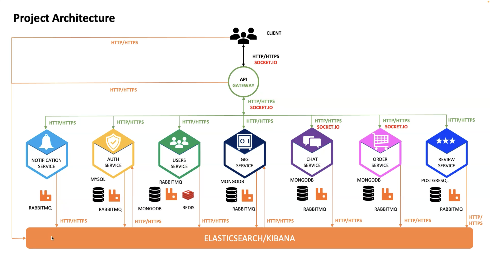

## MarketPlace-App 
The market-place application is built with `React`, `Typescript`, `Tailwindcss` for the Frontend and `NodeJS `for the backend

### Tools for 
These services are required to be executed first with so as to prevent errors when you start your microservices
- Killing running processes `sudo lsof -i :portNumber` and `kill PID`
- Run one command to start services: `docker compose up -d redis mongodb mysql postgres rabbitmq elasticsearch kibana`
Stopping running services `docker compose down -d redis mongodb mysql postgres rabbitmq elasticsearch kibana`
- redis `docker compose up -d redis`
- mongodb `docker compose up -d mongodb`
- mysql `docker compose up -d mysql`
- postgres `docker compose up -d postgres`
- rabbitmq `docker compose up -d rabbitmq`
- elasticsearch `docker compose up -d elasticsearch`
### Kubernetes
The `marketplace-k8s` folder contains the objects code needed to deploy the microservices to kubernetes.
The microservices are deployed to both `Minikube` and `AWS EKS Cluster`
### Microservices

### Volumes
