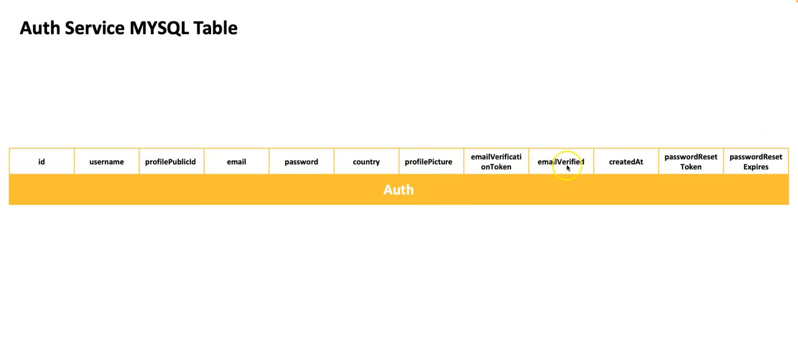

### NodeJS Authentication Microservice 

The Authentication Schemas for the project will incorporate Frontend and Backend Validation

- `Joi` will be for Backend Schemas Validation `https://joi.dev/api/?v=17.13.3`
- `MSQL` with Sequelize `https://sequelize.org/docs/v7/databases/mysql/` to build models`